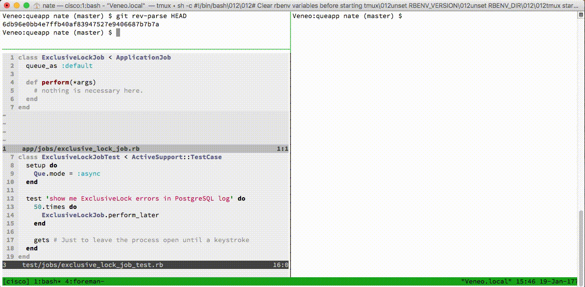

# Que 0.12.0 and Rails 5

[Que 0.12.0][] does not work with [Rails 5][]. The PostgreSQL exclusive locks
which it uses when workers pull jobs incorrectly attempts to release those
locks on a different database connection than the one on which it was created.

This can be seen in the PostgreSQL logs as:

```plain
WARNING:  you don't own a lock of type ExclusiveLock
```

Eventually, the PostgreSQL server becomes overrun with open locks and exhausts
its (configurable) max open lock count and refuses to allow any further locks
to be created. This functionally stops the workers from working and the
application from obtaining its own locks for data insertions.

This repository shows a minimum viable exploit of the issue.

After setting up your `config/database.yml` to connect to your local PostgreSQL
instance:

```sh
./bin/rake db:create
./bin/rake db:migrate
./bin/rake
```

You'll see something like the following:



[Que 0.12.0]: https://rubygems.org/gems/que
[Rails 5]: https://rubygems.org/gems/rails
